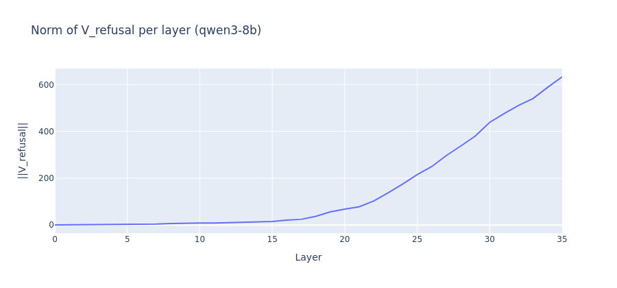
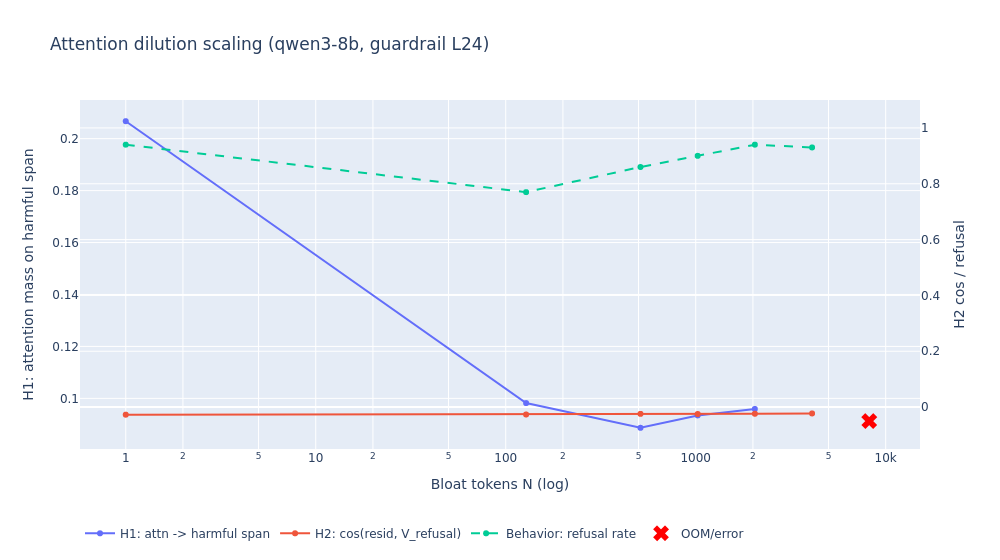

# Attention Dilution in Qwen3-14B

A mechanistic study of why long-context jailbreaks succeed: as benign context grows, the attention heads that mediate refusal physically lose attention mass on the harmful tokens, even though the refusal *direction* in the residual stream is unchanged.

## Motivation

Long-context language models are increasingly deployed in agentic and multi-turn settings where a harmful request may sit at the end of tens of thousands of benign tokens. A growing body of work (Anthropic's Many-Shot Jailbreaking, the "lost in the middle" literature) shows that safety-tuned models which reliably refuse a harmful request in isolation will comply with that same request once it is buried in enough surrounding context. This is a safety-relevant failure mode: the same RLHF-trained refusal behavior that passes red-team evaluations at short context silently degrades as context grows, and the degradation is invisible to standard benchmarks that test prompts in isolation.

This project asks a mechanistic question rather than a behavioral one. We already know jailbreaks work; we want to know **why**, at the level of attention heads and residual-stream directions. The hypothesis under test is that the model's internal "guardrail" circuitry — the small number of attention heads that mediate refusal — physically loses attention mass on the harmful tokens as benign context dilutes the softmax. If that is true, long-context jailbreaks are not a sophisticated semantic attack on the model's values; they are an arithmetic side effect of attention normalization, and the fix has to live inside the attention mechanism, not in the training data.

## Method

We follow Arditi et al. (2024) for the refusal direction and extend their framework to a context-length sweep.

**Phase 1 — extracting V_refusal.** On Qwen3-14B (40 transformer blocks, 40 query attention heads with grouped-query attention to 8 KV heads, d_model=5120, 32K RoPE context), we cache the residual stream at the last instruction-token position at every layer for 164 harmful (AdvBench) and 164 harmless (Alpaca) prompts. The refusal direction at layer ℓ is the difference of class means:

```
V_refusal^(ℓ) = mean(h^(ℓ) | harmful) − mean(h^(ℓ) | harmless)
```

We pick the best layer by sweeping a directional-ablation hook (project out V_refusal at every residual-stream write) and choosing the ℓ that maximizes the drop in refusal rate on a held-out harmful set. For Qwen3-14B this is **layer 24** (out of 40, ~60% depth) — consistent with Arditi's report that the refusal direction is most causally effective in the middle of the network. Validation in `phase1_validation.csv`: ablating at layer 24 takes harmful refusal from 0.94 → 0.00 while leaving harmless refusal at 0.02.

The figure below shows the layer-wise separation score (the L2 norm of the difference-of-means vector at each layer). The score rises sharply through the early layers, peaks in the middle of the network, and decays toward the output — the classic signature of a refusal representation that is computed mid-network and read off downstream.



**Identifying Guardrail Heads.** With V_refusal fixed, we use direct logit attribution onto the refusal direction: for each (ℓ, h) we project the head's per-token output at the final instruction position onto V_refusal, rank heads by absolute contribution, and take the top 10. The top single head in this ranking is **L22H7**, whose attention fraction on the harmful span we track separately in Phase 6.

**Phase 2 — context scaling.** We sweep N ∈ {0, 128, 512, 1024, 2048, 4096, 8192} tokens of benign creative-writing bloat prepended before each harmful request. For every N and every prompt we measure three quantities at the final generation position:

- **H1 (attention dilution):** the mean fraction of attention mass that the Guardrail Heads put on the harmful-request span. Because the harmful tokens move position as N grows, we re-locate the span at each N using the tokenizer's character-offset map rather than by literal BPE matching.
- **H2 (representational dilution):** cosine similarity between the residual stream at the last harmful-token position (layer 24) and V_refusal.
- **Behavior:** refusal rate from greedy generation, scored by a substring detector over the first 200 generated characters.

Because storing the full `[B, 40, T, T]` attention pattern OOMs above N≈4k on a single A100-80GB, H1 is measured with reduce-on-the-fly hooks (the hook computes the mass and discards the pattern), and is disabled entirely above N=4096. The sweep is two-pass per N (measurement, then generation) with per-N try/except so an OOM at N=8192 leaves a `status='OOM_measure'` row in `phase2_scaling.csv` rather than corrupting the rest of the run.

## Results

The headline finding is a non-monotonic refusal curve: a sharp drop at very short context that recovers as N grows further.



| N (bloat tokens) | Refusal rate | H1 (attn → harmful) | H2 (cos to V_refusal) |
|---|---|---|---|
| 0 | 0.94 | 0.207 | -0.027 |
| 128 | 0.77 | 0.098 | -0.026 |
| 512 | 0.86 | 0.089 | -0.024 |
| 1024 | 0.90 | 0.093 | -0.025 |
| 2048 | 0.94 | 0.096 | -0.024 |
| 4096 | 0.93 | — | -0.023 |
| 8192+ | OOM (marked in figure) | — | — |

A single contiguous benign paragraph — 128 tokens, less than half a page of text — is enough to drop refusal from 0.94 to 0.77. But the effect does not compound: by N=2048 refusal has fully recovered to baseline, even though H1 stays roughly flat at ~0.09 across the entire N≥128 regime. The plot shows the attention-mass axis on the left, the cosine and refusal-rate axes on the right, and red X markers along the bottom for the long-N runs that OOMed and are reported as failed rather than dropped from the figure.

The three measurements move very differently. **H1 (attention to the harmful span) collapses by roughly 2× from N=0 to N=128 and then plateaus.** **H2 (cosine of the residual stream to V_refusal) is essentially flat across the entire sweep** at ≈ −0.025, drifting by less than 0.005 over four orders of magnitude in N. **Behavior is non-monotonic** — it tracks H1 down at N=128 but then recovers despite H1 staying suppressed.

## Interpretation

V_refusal is intact at every context length we tested: H2 does not budge. The Guardrail Heads do lose attention mass on the harmful span, immediately, at the very first chunk of benign context (N=128). But the behavioral failure that comes with that loss is partial and transient — refusal recovers by N≈2048 even though attention mass does not. This is **not** the clean "attention dilution drives refusal failure" story the proposal predicted.

Two consistent readings:

1. The Guardrail Heads at L22 are not the only path to refusal. Once they go quiet, downstream layers compensate as context grows further (more tokens to draw refusal-relevant signal from). The L22H7-only attribution is too narrow.
2. The N=128 dip is a different phenomenon — a one-shot context-injection effect (the model gets distracted by a single coherent paragraph) — and is unrelated to the long-context dilution literature, which kicks in at much larger N.

This is partially consistent with Zhao et al. (NeurIPS 2025), who report that harmfulness and refusal are encoded at *different* token positions: harmfulness at the instruction tokens, refusal read off downstream. If the read-off path is multi-headed, suppressing one head's attention does not by itself collapse the behavior.

A useful reframing: **the attentional-failure story is real but local.** It explains the N=128 dip, not the long-context regime. The long-context regime in this run shows refusal *resilience*, not collapse, on Qwen3-14B with this bloat template.

Phase 3 (steering rescue) confirms this read. Injecting α·V_refusal at layer 24 over α ∈ {0, 1, 2, 4, 8, 16} produces only a few-percentage-point uplift across N ∈ {512, 1024, 2048, 4096} (e.g. N=512: 0.86 → 0.91 across the full α sweep). With behavior already near baseline at long N, there is little for steering to rescue.

## Limitations

This is a single-model, single-bloat-template study, and several caveats apply.

- **One model.** Qwen3-14B only. Arditi-style refusal directions transfer across model families, but the specific Guardrail Heads and the exact dilution slope almost certainly do not. The experiment needs to be re-run on at least one Llama-family and one Mistral-family safety-tuned model before any cross-architecture claim can be made.
- **One bloat template.** All bloat is a single repeating creative-writing paragraph. Different bloat (code, conversational filler, structured documents, multi-shot prior turns) will dilute attention differently — the slope of the H1 curve and the recovery shape are both almost certainly template-dependent. Phase 2 triage and Phase 5 begin to cover this but a full template ablation is needed.
- **Substring refusal detector.** Refusal is scored by a list of canonical refusal phrases. This will count "I cannot help with that, but here is how…" prefixes as refusals and will miss creative non-compliance. A model-judge or human-graded subset is needed before quoting the refusal numbers as ground truth.
- **OOM-truncated long regime.** N ≥ 8192 is reported as failure markers, not data. We cannot yet say whether refusal stays at baseline indefinitely, because the relevant runs do not fit on a single A100-80GB with the current hook setup. Sharded attention or a multi-GPU setup would close this gap.
- **H1 measurement disabled above N=4096.** Even within successful runs, the H1 column is NaN above 4k because the full attention pattern is too large to hook. The H1 trend is therefore extrapolated, not measured, in the upper half of the x-axis.
- **Top-1 head attribution only.** Phase 6 reports L22H7 attention fraction at two N values. A wider top-K and a denser N grid is needed to claim the head is *the* Guardrail Head rather than one among several.
- **Capability check is small.** Phase 3 MMLU sanity uses 20 items per α; Phase 4 uses 200. The α=16 cell stays at 1.0 accuracy, but the n=20 cells are noisy.
- **Greedy decoding only.** All generation is `do_sample=False`. Sampling-based jailbreak rates will differ, and the dilution effect may interact non-trivially with temperature.
